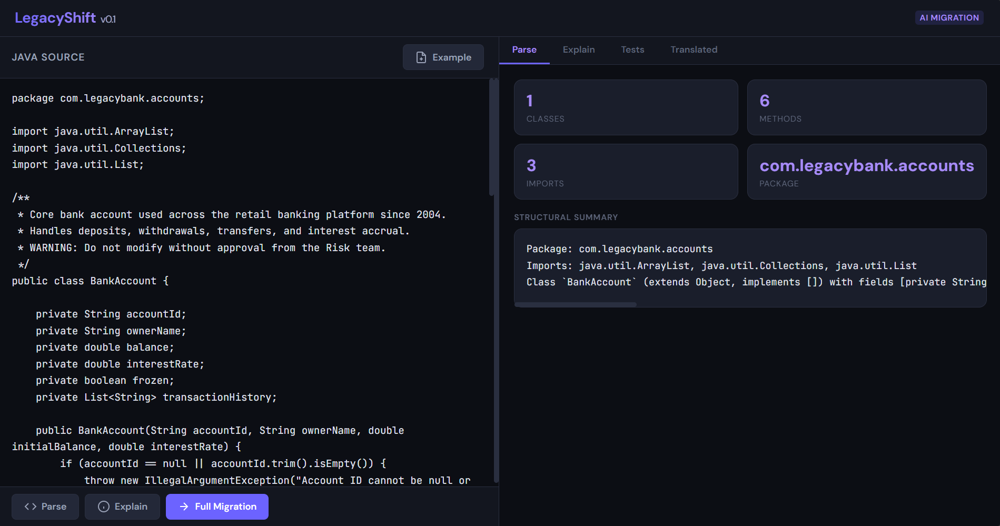
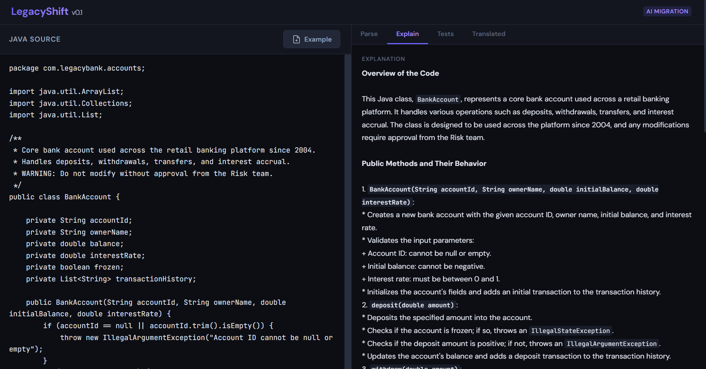
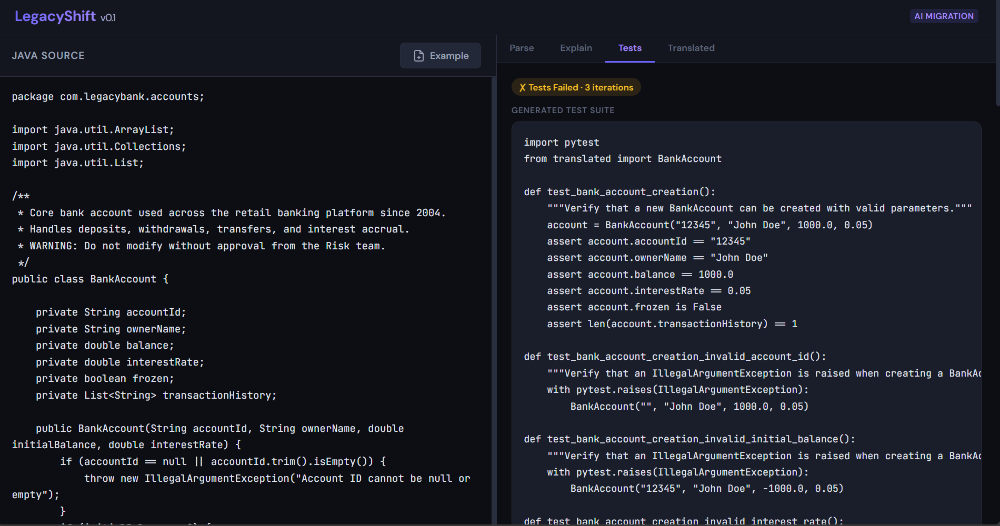
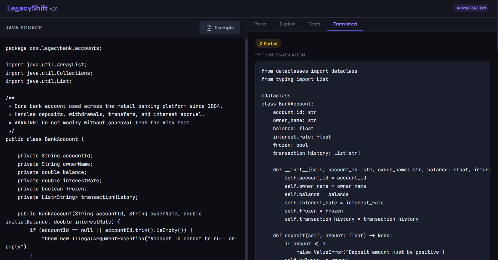

# LegacyShift

**AI-powered legacy code migration tool** — explains, tests, and rewrites old code safely.

Banks and insurers run on millions of lines of legacy Java (and COBOL). Nobody wants to touch it because if it breaks, the business loses money. LegacyShift gives engineers an AI-assisted pipeline that **prioritises test-driven safety** over speed: it generates a comprehensive test suite *before* attempting translation, then uses a feedback loop to iteratively fix failures until the tests pass.

---

## Product overview

### Problem

- **Legacy code is a liability.** Large codebases in Java and COBOL are hard to understand, risky to change, and expensive to maintain. Teams lack visibility into what code does and fear regressions.
- **Manual migration is slow and error-prone.** Rewriting by hand doesn’t scale; ad-hoc scripts or one-off LLM use lack a repeatable, test-driven process and leave no audit trail.
- **Stakeholders need assurance.** Risk, compliance, and engineering leads need evidence that behaviour is preserved and that migrations can be reviewed and measured.

### Who it’s for

| Persona | Use case |
|--------|----------|
| **Platform / engineering leads** | Assess and pilot legacy modernisation; get explainability and quality metrics before committing to large migrations. |
| **Developers** | Understand unfamiliar code (Explain), generate tests and Python translations (Migrate), and iterate with a safety net. |
| **Risk / compliance** | See plain-English explanations and test-first design; use quality stats and run history as evidence of controlled change. |

### Value

- **Safety first:** Tests are generated *before* translation; the pipeline only succeeds when those tests pass (or surfaces “partial” for review).
- **Explainability:** Every migration is explained in plain English, so behaviour is documented and reviewable.
- **Measurability:** Quality score, success rate, and run history (`/stats`, `/migrations`) support prioritisation and reporting.
- **Flexibility:** Works with Java and COBOL; supports OpenAI, Azure OpenAI, or free local models (Ollama). No vendor lock-in.

### Problematic — risks and limitations

- **Output is not production-ready by default.** All translations are AI-generated and must be reviewed and tested in your environment. “Partial” means tests did not all pass; treat it as a draft, not a release.
- **Single-file / single-unit scope.** The tool operates on one source file or program at a time. Multi-file or multi-module projects need to be broken down and migrated incrementally.
- **Language and size limits.** Java 8 and COBOL are supported; very large files can hit timeouts or token limits. Parsing is best-effort for COBOL (regex-based); complex or non-standard dialects may not parse correctly.
- **Dependencies.** Full quality tracking and few-shot learning need Postgres + pgvector and (for embeddings) an API key. Without them, the tool still runs but does not persist history or improve from past runs.
- **Cost and rate limits.** LLM calls cost money and may be rate-limited. Use the free Ollama path for demos; set `RATE_LIMIT_PER_MINUTE` and timeouts for shared deployments.

### How we measure success

- **Per run:** `status` (success / partial / failed), `test_passed`, `iterations`, and `quality_score` (0–1) indicate whether the migration met the bar and how many retries were needed.
- **Over time:** `GET /stats` gives success rate, average iterations, and average quality score so you can track pipeline health and prioritise problematic modules.
- **Human-in-the-loop:** The design assumes human review before production. Success is “safe, explainable, and measurable,” not “fully automated deployment.”

---

## Demo

The web UI lets you paste Java code, **parse** its structure, **explain** it in plain English, **generate tests**, and **translate** to Python — all in one place.

Run the app with `uvicorn legacy_shift.api:app --host 0.0.0.0 --port 8000` and open **http://localhost:8000**.

### Parse — structural summary (no LLM)

Parse Java to see classes, methods, imports, and a structural summary.



### Explain — plain-English breakdown

Get a plain-English explanation of what the code does and how it behaves.



### Tests — generated pytest suite

Generate a pytest suite before translation; the pipeline retries until tests pass or max iterations.



### Translated — Java → Python

Java is translated to Python with dataclasses, type hints, and preserved business logic.



---

## Architecture

```
┌──────────────────────────────────────────────────────────────┐
│                     LegacyShift Pipeline                     │
│                                                              │
│  ┌─────────┐   ┌─────────┐   ┌───────────┐   ┌──────────┐  │
│  │  Parse   │──▶│ Explain │──▶│  Generate  │──▶│Translate │  │
│  │(Tree-    │   │  (LLM)  │   │   Tests    │   │  (LLM)   │  │
│  │ sitter)  │   │         │   │   (LLM)    │   │          │  │
│  └─────────┘   └─────────┘   └───────────┘   └────┬─────┘  │
│                                                     │        │
│                              ┌───────────┐   ┌─────▼─────┐  │
│                              │  Retry w/  │◀──│   Run     │  │
│                              │  Feedback  │   │  Tests    │  │
│                              │  (LLM)     │──▶│  (pytest) │  │
│                              └───────────┘   └───────────┘  │
│                                                              │
│  Observability: LangSmith / Phoenix    Vector DB: pgvector   │
│  LLM Routing:  LiteLLM                API: FastAPI           │
└──────────────────────────────────────────────────────────────┘
```

### Key design decisions

| Concern | Choice | Why |
|---------|--------|-----|
| **AST parsing** | Tree-sitter (Java grammar) | Structural context helps the LLM understand the code beyond raw text |
| **Prompt chain** | LangGraph state machine | Deterministic flow with conditional retry edges |
| **Test-first safety** | Tests generated *before* translation | The tests define correctness; the translator must satisfy them |
| **Feedback loop** | pytest stdout fed back into translation prompt | Self-healing: the LLM sees its own failures and fixes them |
| **LLM routing** | LiteLLM / `init_chat_model` | Swap providers (OpenAI, Anthropic, Azure) without code changes |
| **Pattern memory** | pgvector | Store successful translations as few-shot examples for future runs |
| **Observability** | LangSmith + Arize Phoenix | Full trace of every LLM call for evaluation and debugging |
| **Packaging** | Docker Compose | One command to spin up app + Postgres + Phoenix |

---

## Quick Start

### 1. Clone and configure

```bash
git clone <repo-url> && cd legacy-shift
cp .env.example .env
# Edit .env — set OPENAI_API_KEY (or Azure) for paid APIs, or use the free option below
```

**Free local model (no API key):** To use a free model with no quota or billing, use [Ollama](https://ollama.com). Install Ollama, then in a terminal run:

```bash
ollama run llama3.2
```

Leave `OPENAI_API_KEY` and Azure keys empty in `.env`. The app will use `ollama/llama3.2` automatically. You can also set `DEFAULT_MODEL=ollama/llama3.2` and `OLLAMA_BASE_URL=http://localhost:11434` explicitly.

### 2a. Run with Docker (recommended)

```bash
docker compose up --build
```

This starts:
- **App** on `http://localhost:8000` (FastAPI)
- **Postgres + pgvector** on port 5432
- **Phoenix** on `http://localhost:6006` (trace UI)

### 2b. Run locally

```bash
python -m venv .venv && source .venv/bin/activate  # or .venv\Scripts\activate on Windows
pip install -e ".[dev]"
```

### 3. Use the CLI

```bash
# Full migration pipeline (explain → test → translate → verify)
legacy-shift migrate examples/BankAccount.java -o output/

# Just explain the code
legacy-shift explain examples/BankAccount.java

# Just generate tests (no translation)
legacy-shift generate-tests examples/BankAccount.java -o output/
```

### 4. Use the API

```bash
# Parse only (no LLM, instant)
curl -X POST http://localhost:8000/parse \
  -H "Content-Type: application/json" \
  -d '{"source_code": "public class Foo { public int bar() { return 42; } }"}'

# Full migration
curl -X POST http://localhost:8000/migrate \
  -H "Content-Type: application/json" \
  -d @- <<'EOF'
{
  "source_code": "... your Java code ...",
  "max_retries": 3
}
EOF
```

Interactive API docs (OpenAPI) are at **http://localhost:8000/docs** when the server is running.

### Quality tracking

Each migration run is recorded in a local SQLite DB (`data/migration_runs.db`). You can:

- **GET /stats?days=30** — success rate, total runs, average iterations, average quality score (0–1).
- **GET /migrations?limit=50** — recent runs with status, iterations, duration, quality score.

The **quality score** is derived from status (success/partial/failed) and number of translate retries; it is returned in each migrate response as `quality_score`.

---

## Limitations (technical)

- **Scope:** One file or program per run. Very large files may hit timeouts or token limits; use `MIGRATION_TIMEOUT_SECONDS` and `MAX_SOURCE_CODE_CHARS` in `.env` or split input.
- **Languages:** Java 8 (full AST) and COBOL (regex-based structure). Other languages require adding a parser and prompts.
- **Pattern store:** Few-shot learning and pattern storage require Postgres + pgvector and (for embeddings) `OPENAI_API_KEY`. Optional; translations work without them.
- See **Problematic — risks and limitations** above for product-level caveats.

---

## Project Structure

```
legacy-shift/
├── legacy_shift/
│   ├── cli.py              # Click CLI (migrate, explain, generate-tests)
│   ├── api.py              # FastAPI REST server
│   ├── config.py           # Pydantic Settings (.env loading)
│   ├── graph/
│   │   ├── state.py        # MigrationState TypedDict
│   │   ├── nodes.py        # LangGraph node functions (explain, test_gen, translate)
│   │   └── workflow.py     # LangGraph compile (entry → explain → test_gen → translate → run_tests ↻)
│   ├── parser/
│   │   └── ast_parser.py   # Tree-sitter Java parser → structured ClassInfo/MethodInfo
│   ├── vector/
│   │   └── store.py        # pgvector pattern store (successful translations as few-shot)
│   ├── feedback/
│   │   └── loop.py         # Run pytest in tmpdir, capture pass/fail, return errors
│   ├── tracing/
│   │   └── observability.py # LiteLLM init + LangSmith + Phoenix OTEL setup
│   └── prompts/
│       ├── explain.py       # Explain prompt template
│       ├── test_gen.py      # Test generation prompt template
│       └── translate.py     # Translation prompt template (with feedback variant)
├── tests/                   # pytest suite for the tool itself
├── examples/                # Sample Java 8 files (BankAccount, InsurancePolicy)
├── Dockerfile
├── docker-compose.yml       # app + postgres/pgvector + phoenix
├── pyproject.toml
└── .env.example
```

---

## Running Tests

```bash
pip install -e ".[dev]"
python -m pytest -v
```

On Windows, use `python -m pytest -v` so the venv’s pytest is used (the `pytest` script may not be on PATH).

The test suite covers:
- **Parser tests** — verify Tree-sitter extracts classes, methods, fields, imports
- **Graph tests** — verify the LangGraph compiles and has expected nodes
- **API tests** — verify FastAPI /parse and /health endpoints
- **Feedback tests** — verify the test-runner correctly detects pass/fail

---

## Extending

### Supported source languages

- **Java** — full Tree-sitter parsing; use `source_language: "java"` or `.java` files in CLI.
- **COBOL** — regex-based structure extraction (PROGRAM-ID, paragraphs, sections); use `source_language: "cobol"` or `.cbl`/`.cob` files in CLI. Example: `examples/HelloCalc.cbl`.

### Add another source language

1. Add a parser in `legacy_shift/parser/` with a `parse(source) -> result` and `result.summary()`.
2. Register it in `parser_factory.get_parser(source_language)`.
3. Add language-specific prompts in `legacy_shift/prompts/` and select them in `graph/nodes.py` by `source_language`.

### Add a new target language

1. Add a translation prompt variant in `legacy_shift/prompts/translate.py`
2. Update `run_tests_node` in `legacy_shift/feedback/loop.py` to run the target language's test runner

### Improve accuracy over time

After each successful migration, store the (source, translation) pair in pgvector via `PatternStore.add_pattern()`. Future runs can retrieve similar patterns as few-shot examples.

---

## License

MIT
